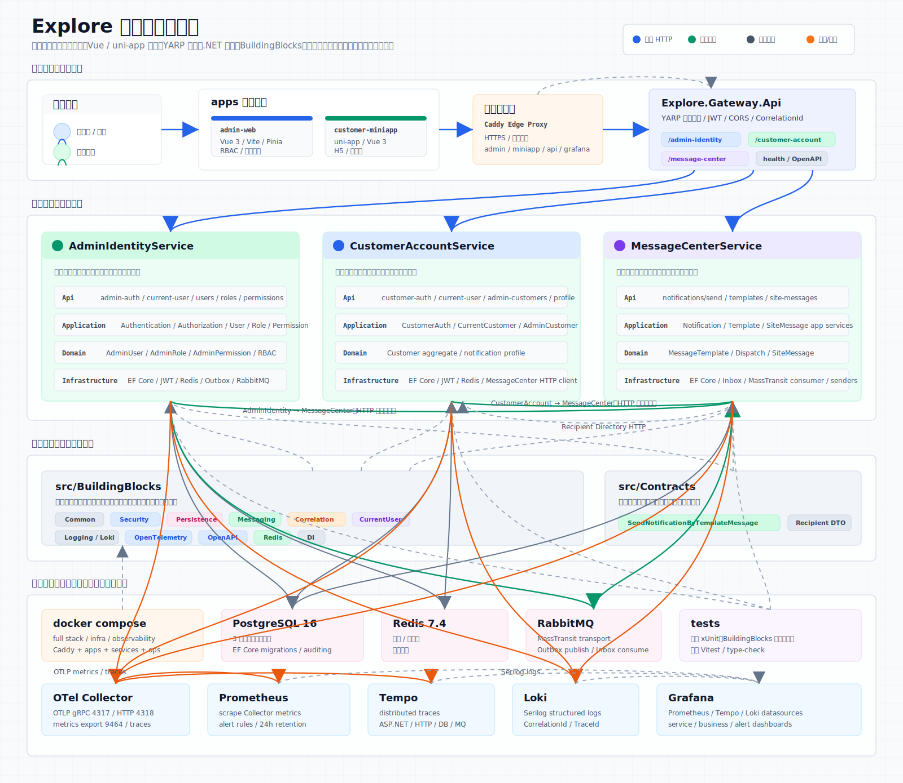

# Explore

## 项目架构图



Explore 是一个前后端一体的多应用仓库，包含管理端、客户小程序、API Gateway、多个后端服务以及一组可复用的 `BuildingBlocks` 基础模块。文档目标不是把所有细节堆在根目录，而是让新加入的开发者先理解系统组成，再快速跳到对应子系统文档继续深入。

## 项目概览

- 前端应用
  - `apps/admin-web`：管理后台，面向内部运营或管理员。
  - `apps/customer-miniapp`：客户侧 uni-app 应用，支持 H5 / 小程序方向开发。
- 接入层
  - `src/Gateways/Explore.Gateway.Api`：统一入口，负责路由转发、鉴权、CORS、健康检查。
- 业务服务
  - `src/Services/AdminIdentityService`：管理员认证、授权、角色与权限能力。
  - `src/Services/CustomerAccountService`：客户账户、登录态、资料维护。
  - `src/Services/MessageCenterService`：消息模板、同步通知接口、异步投递与站内信能力。
- 基础模块
  - `src/BuildingBlocks`：不仅包含通用工具，还承载认证与安全、Correlation / CurrentUser、自动依赖注入、领域基础抽象、持久化审计、OpenAPI、消息抽象以及 RabbitMQ / EF Core 集成能力。
  - `src/Contracts`：跨服务共享契约。
- 测试与环境
  - `tests`：后端测试项目。
  - `docker`：开发与测试基础设施编排。
  - `docs`：设计说明与补充文档。

## 目录导航

| 路径 | 说明 | 文档入口 |
| --- | --- | --- |
| `apps/` | 所有前端应用 | [apps/README.md](apps/README.md) |
| `src/` | 网关、服务、基础模块、契约 | [src/README.md](src/README.md) |
| `src/BuildingBlocks/` | 基础模块能力与依赖清单 | [src/BuildingBlocks/README.md](src/BuildingBlocks/README.md) |
| `src/Services/` | 业务服务总览 | [src/Services/README.md](src/Services/README.md) |
| `docker/` | Docker Compose 与本地基础设施 | [docker/README.md](docker/README.md) |
| `tests/` | 后端测试说明 | [tests/README.md](tests/README.md) |
| `docs/` | 设计与集成文档 | [docs/README.md](docs/README.md) |

## 技术栈摘要

- 后端：`.NET 10`、ASP.NET Core、EF Core、YARP、Serilog
- BuildingBlocks 相关底座：MassTransit、RabbitMQ、FreeRedis、Scalar、JWT
- 数据与中间件：PostgreSQL、Redis、RabbitMQ
- 管理端：Vue 3、TypeScript、Vite、Pinia、Vue Router、Element Plus
- 客户端：uni-app、Vue 3、TypeScript
- 测试：xUnit、Vitest

`BuildingBlocks` 的详细能力矩阵、显式 NuGet 依赖和消费关系不再写在根 README 中，统一见 [src/BuildingBlocks/README.md](src/BuildingBlocks/README.md)。

## 通知与消息链路

- `AdminIdentityService` 当前同时使用两种消息中心集成方式：短信验证码仍通过 `MessageCenter` HTTP API 发送；管理员站内信改为写本地 Outbox，再通过 RabbitMQ 投递给 `MessageCenterService`。
- `CustomerAccountService` 当前仍通过 `MessageCenter` HTTP API 发送通知。
- `MessageCenterService` 同时提供同步入口 `POST /api/notifications/send`，并消费异步契约 `SendNotificationByTemplateMessage`；站内信由本服务落库，并通过 `/api/site-messages` 提供查询与已读能力。

## 本地开发最短路径

### 路径 1：整套 Docker 开发环境

1. 先阅读 [docker/README.md](docker/README.md)。
2. 先复制 `docker/env/*.env.example` 生成自己的本地环境文件，再填写域名、Token 和开发密码。
3. 在仓库根目录执行：

```bash
docker compose -f docker/compose.dev.yaml up --build -d
```

适合需要快速拉起前后端联调环境的场景。

### 路径 2：基础设施容器 + 本地运行应用

1. 先启动数据库、Redis、RabbitMQ：

```bash
cp docker/env/dev-infra.env.example docker/env/dev-infra.env
docker compose --env-file docker/env/dev-infra.env -f docker/compose.dev-infra.yaml up -d
```

2. 本地启动后端服务与网关：

```bash
dotnet run --project src/Services/AdminIdentityService/Explore.AdminIdentityService.Api
dotnet run --project src/Services/CustomerAccountService/Explore.CustomerAccountService.Api
dotnet run --project src/Services/MessageCenterService/Explore.MessageCenterService.Api
dotnet run --project src/Gateways/Explore.Gateway.Api
```

3. 分别进入前端目录启动开发服务器：

```bash
cd apps/admin-web
npm install
cp .env.example .env.local
npm run dev
```

```bash
cd apps/customer-miniapp
npm install
cp .env.example .env.local
npm run dev:h5
```

适合日常开发与断点调试。

## 常用命令

```bash
dotnet test Explore.slnx
```

```bash
cd apps/admin-web
npm test
```

```bash
cd apps/customer-miniapp
npm run type-check
```

## 推荐阅读顺序

1. 先看 [docker/README.md](docker/README.md)，明确本地依赖如何启动。
2. 再看 [src/Services/README.md](src/Services/README.md)，理解服务边界和依赖关系。
3. 想看基础能力和 NuGet 依赖时进入 [src/BuildingBlocks/README.md](src/BuildingBlocks/README.md)。
4. 需要前端联调时进入 [apps/README.md](apps/README.md) 选择对应应用。
5. 需要设计背景时查看 [docs/README.md](docs/README.md)。

## 设计与补充文档

- [docs/project-template-spec.md](docs/project-template-spec.md)：仓库结构与工程分层规范。
- [docs/admin-identity-rbac-frontend-integration.md](docs/admin-identity-rbac-frontend-integration.md)：管理端与权限模型的前后端对接说明。
